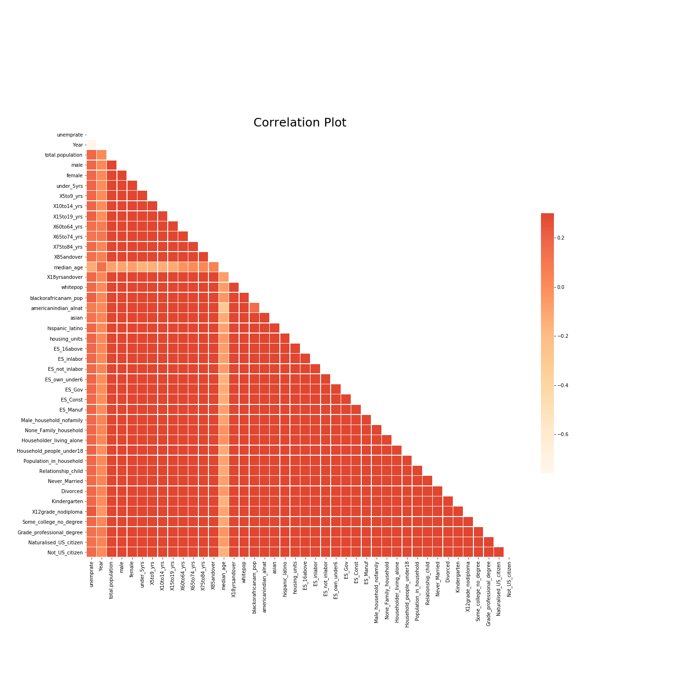

### EAS 503 - Programming and Database Fundamentals for Data Science
### Prediction of State-wise Unemployment Rate in US
## Introduction
*The U.S Department of Labor, specifically the Bureau of Labor Statistics (BLS), began collecting employment information via monthly household surveys. Other data series are available back to 1912. The unemployment rate has varied from as low as 1% during World War I to as high as 25% during the Great Depression (in most countries it started in 1929 and lasted until 1941. It was the longest, deepest, and most widespread depression of the 20th century). More recently, it reached peaks of 10.8% in November 1982 and 10.0% in October 2009. Unemployment tends to rise during recessions and fall during expansions. From 1948 to 2015, unemployment averaged about 5.8%. The United States has experienced 11 recessions since the end of the postwar period in 1948.*

*The U.S. Bureau of Labor Statistics has defined the basic employment concepts as follows:*
- People with jobs are employed.
- People who are jobless, looking for jobs, and available for work are unemployed.
- People who are neither employed nor unemployed are not in the labor force.
*Predicting unemployment rates will be helpful for the state level planning of job market.*

*Note: This analysis and prediction is based on the assumption that the COVID-19 has not occurred and the trend continues.*


---

## Sources
[Demographic Characteristics](https://data.census.gov/cedsci/table?d=ACS%205-Year%20Estimates%20Data%20Profiles&table=DP05&tid=ACSDP5Y2015.DP05)
- Demographic data refer to the Decennial Census and other surveys of individuals
and households administered by the Census Bureau.
- Includes Sex and Age, Race, Hispanic Origin, Housing Units, etc.

[Economic Characteristics](https://data.census.gov/cedsci/table?d=ACS%205-Year%20Estimates%20Data%20Profiles&table=DP03&tid=ACSDP5Y2015.DP03)
- Economic data or economic statistics are data (quantitative measures) describing an
actual economy, past or present.
- Includes Income, Employment, Occupation, Commuting to Work, etc.

[Social Characteristics](https://data.census.gov/cedsci/table?d=ACS%205-Year%20Estimates%20Data%20Profiles&table=DP02&tid=ACSDP5Y2015.DP02)
- Social, cultural, religious and other characteristics of a person or group of people which contribute to the specification of the population to which they belong. For example, first language spoken, indigenous status, religious affiliation, sex.
- Includes Education, Marital Status, Relationships, Grandparents, etc.

[Unemployment Rate](http://www.dlt.ri.gov/lmi/laus/us/annavg.htm)
- Includes year wise Unemployment Rate Data.
---

## Database Creation
- Raw data has been extracted for each aspect (Social, Economic, Demographic,
Unemployment Rate) from year 2010 to 2018.
- Created a Database with 36 tables for the respective raw data.
- Populated each table with the values from the raw data.
- Performed ‘UNION ALL’ operation in combining the year-wise data of each aspects
with the help of Common Table Expression (CTE).
- Performed ‘INNER JOIN’ operation in merging the data of each aspect with the help
of Common Table Expression (CTE).
- Finally queried the merged data from the Database for Feature Engineering,
Exploratory Data Analysis (EDA), and Model Fitting.

*Note: Created and Populated Database by Integrating Database and Python using SQLite3.*

## Packages used for EDA
```
import pandas as pd
import numpy as np
import matplotlib.pyplot as plt
import seaborn as sns 
import json
import requests
from sklearn.preprocessing import StandardScaler
import plotly.express as px
```

### Data Visualization:

#### Bar plot showing range of Unemployment rates in different states:


#### Trend in Unemployment rate in United states:


#### Distribution of various Factors:


#### Correlation Plot:



#### United States Map showing Average Unemployment Rate from 2010 - 2018:


### Model Results:


### Conclusion and Remarks:
- *Our objective was to analyze and predict unemployment rate with the help of social, economic and demographic data.* 
- *Exploratory Data Analysis was done by creating and analyzing various plots such as correlation plot, box plot, maps etc. to identify patterns and anomalies in the data.*
- *Since we had less data (469 samples) we implemented K-fold cross validation and evaluation metrics such as Root mean square error (RMSE) and Mean absolute error (MAE) for evaluating various models.*
- *We used linear models and regularization methods such as linear regression, LASSO, RIDGE and tree-based methods such as Random Forest.*
- *Since we know that the data had multi collinearity between variables, we had to implement regularization methods and Principle Component Regression (PCR).*
- *The data for Principle Component Regression was obtained from Principle component analysis where we reduced the dimension of the data from 43 dimensions to 6.*
- *From this detailed analysis it is evident that Principle Component Analysis is the best model for predicting the Unemployment Rate.*
---
